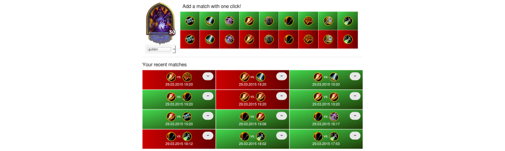

# HearthstoneArenaTracker

A rails 4 demo app I created for fun and for tracking my arena / match performance. 



## View it on Heroku

The currently deployed app can be visited at: https://immense-retreat-3364.herokuapp.com/ (be patient since I'm using the free plan the dyno needs some time to spin up.

## Run it locally

A brief description for running the app locally.

### Prerequisites

* Rails 4.2.0
* Ruby 2.2.0
* bundler
* Postgres DB 

### Bundle

```
bundle install
```

### Database setup

This app runs on a Postgres DB. Make sure to have Postres installed (`which postgres`) and connect to the DB via the shell:

```
psql -dpostgres
```

We need to create our databases and users:

```
postgres=# create user hat_demo with password 'hat_demo';
CREATE ROLE
postgres=# create user hat_demo_test with password 'hat_demo_test';
CREATE ROLE
postgres=# alter user hat_demo superuser;
ALTER ROLE
postgres=# alter user hat_demo_test superuser;
ALTER ROLE
postgres=# create database hearthstone_arena_tracker;
CREATE DATABASE
postgres=# create database hearthstone_arena_tracker_test;
CREATE DATABASE
postgres=# grant all privileges on database hearthstone_arena_tracker to hat_demo; 
GRANT
postgres=# grant all privileges on database hearthstone_arena_tracker_test to hat_demo_test; 
GRANT
```

```
rake db:setup
```

Now you should be able to run the app with:

```
rails s
```

it is served [here](http://localhost:3000/)

### Tests

For both unit and feature tests simply run:

```
rspec
```

For unit tests only:

```
rake spec:no_features
```

For features only:

```
rake spec:features
```

### Quality

rubocop and rubycritic can be started via rake task:

```
rake quality
```


